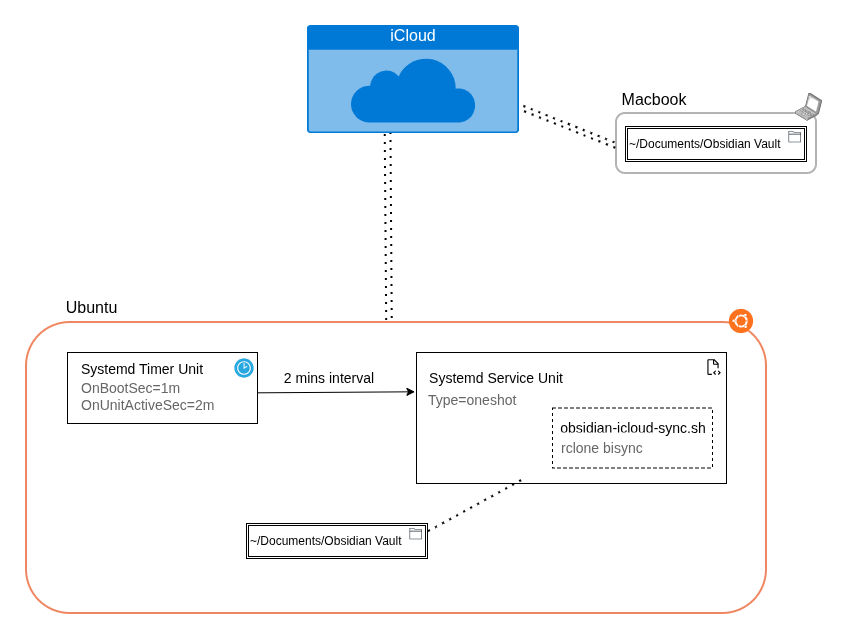

# Syncing an Obsidian Vault with iCloud Drive from Linux

> **Supported OS:** most modern Linux distributions. This setup uses
> `rclone` (with the `iclouddrive` backend), `systemd` user units, and
> a few common CLI tools (`flock`, `notify-send`) — none of which are
> Ubuntu-specific. The only Ubuntu-specific assumptions are `apt` for
> the rclone install in Step 1 (substitute your distro's package
> manager) and `loginctl` for lingering (already a systemd component).
> **Tested on Ubuntu 24.04 LTS and Ubuntu 26.04.**



## Why

Apple ships no official iCloud Drive client for Linux. The Mac keeps
`~/Documents/Obsidian Vault` current automatically via macOS's built-in
iCloud Drive "Desktop & Documents" sync — nothing on the Mac needs to
change. This setup makes Ubuntu independently push/pull the same vault
to/from iCloud using `rclone`'s `iclouddrive` backend, so both machines
end up in sync through iCloud, touching only the Linux side.

## Tradeoffs (read before relying on this)

- **Experimental backend.** `rclone`'s `iclouddrive` backend authenticates
  like the iCloud web client. As of 2026 there are open upstream bugs
  around 2FA code delivery (github.com/rclone/rclone/issues/9359) — the
  2FA prompt can fail to send a code at all. If setup hangs at 2FA,
  cancel and retry, try the SMS/trusted-phone-number path instead of
  device push, or grab the latest rclone release/beta.
- **Trust token expires every ~30 days.** Login is not "set and forget."
  When it expires, scheduled syncs start failing until you re-run
  `rclone config reconnect iclouddrive:`. The wrapper script below fires
  a desktop notification on sync failure so this doesn't go unnoticed —
  but there's no way around the periodic manual re-auth.
- **Offline is silent for the first 30 minutes.** Closing the laptop or
  losing wifi is normal, not a fault, so the wrapper checks connectivity
  before it starts and quietly skips the run. Only if you stay offline
  past 30 minutes does it raise one low-urgency "sync paused" notice,
  and only one per outage. So a quiet sync while travelling is expected
  behaviour — but it does mean "no notification" is not by itself proof
  the vault is current. `critical` notifications are reserved for things
  that genuinely need your hands.
- **Not real-time.** This uses a polling systemd timer (every 2 min),
  not a push/webhook. A change on either side can take up to one
  interval to show up on the other. Real-time (inotify-triggered) sync
  was considered and rejected in favor of simplicity and fewer calls
  against Apple's undocumented rate limits.
- **Rate-limit risk is unquantified.** Apple publishes no rate limits
  for this unofficial API surface. 2 minutes was chosen empirically —
  each no-op sync takes ~3-5s, so this leaves plenty of idle headroom —
  but if `sync.log` starts showing auth/throttling failures, the fix is
  to widen `OnUnitActiveSec` in the timer. There's no hard evidence
  2 min is "safe," just no observed problems.
- **Shared `.obsidian/` settings.** Only `workspace.json` /
  `workspace-mobile.json` (per-device window/pane layout) are excluded
  from sync. Other `.obsidian/*.json` (theme, enabled plugins, etc.) DO
  sync both ways — editing Obsidian settings on one machine can
  overwrite the other's on the next sync. This mirrors what iCloud/any
  full-vault sync would do; it's not unique to this setup.
- **Requires an active or lingering user session.** Handled below via
  `loginctl enable-linger`, but worth knowing: without it, systemd
  --user timers only run while you're logged in.
- **bisync is officially "beta" in rclone**, though widely used for
  exactly this purpose (cloud-synced note vaults). First run must
  always be `--resync` (see step 5) — never skip it, it establishes the
  baseline bisync uses to detect changes/deletions safely.
- **Bisync state can be lost.** The baseline lives in
  `~/.local/share/obsidian-icloud-sync/` (moved out of `~/.cache` so
  it does not get cleared), and the wrapper now detects a missing
  baseline and reruns `--resync` automatically. If you carry older
  versions of these scripts forward, that recovery is not there yet —
  see [`CHANGELOG.md`](CHANGELOG.md) for the failure mode and the fix.

## Prerequisites

- A modern Linux distribution with `systemd` (tested on Ubuntu 24.04
  LTS and Ubuntu 26.04), vault expected at `~/Documents/Obsidian Vault`
- Your Apple ID email + password (not an app-specific password) and
  access to 2FA (trusted device or phone number)
- `notify-send` and `flock` (both ship by default on Ubuntu desktop)

## Files in this directory

In this same folder you'll find the actual setup files (the real,
ready-to-use versions — not just the code blocks shown further down
in this README), plus a helper script called `install.sh` that drops
them where they need to go and turns the timer on for you:

```bash
./install.sh
```

That one command installs everything in a single shot.

> [!WARNING]
> **Don't run `install.sh` yet — finish steps 1–3 and 5 first.**
>
> Before running `install.sh`, you need to do these by hand:
>
> 1. **Step 1** — install rclone (Ubuntu's built-in version is too old)
> 2. **Step 2** — log into your Apple ID and finish the 2FA prompt
> 3. **Step 3** — confirm the exact vault path on iCloud
> 5. **Step 5** — do the first `bisync --resync` to establish a baseline
>
> `install.sh` only copies the files into place and turns the timer
> on. It will **not** type your password, do the 2FA prompt, or run
> the initial sync for you. If you skip those steps, the timer will
> just keep failing every 2 minutes.

## Step 1 — Install rclone (latest, not the apt package)

The `apt` rclone shipped with Ubuntu (24.04 LTS and 26.04) is too old
to include the `iclouddrive` backend. Use the official installer:

```bash
curl https://rclone.org/install.sh | sudo bash
```

Verify:

```bash
rclone version
rclone help backends | grep -i icloud   # should list "iclouddrive"
```

## Step 2 — Configure the iCloud remote

Run interactively (needs your password + 2FA, so do this yourself, not
via automation):

```bash
rclone config
```

- `n` → new remote
- name: `iclouddrive`
- storage type: `iclouddrive`
- Apple ID email, then your regular account password
- complete the 2FA prompt with the 6-digit code
- `y` to confirm, `q` to quit

Verify: `rclone listremotes` should print `iclouddrive:`.

## Step 3 — Find the exact remote path to the vault

With macOS "Desktop & Documents" sync on, `~/Documents` is mirrored at
iCloud Drive's root:

```bash
rclone lsd iclouddrive:
rclone lsd iclouddrive:Documents
```

Confirm `Obsidian Vault` shows up under `Documents/`. This guide
assumes the path `iclouddrive:Documents/Obsidian Vault` — adjust
everything below if your discovery shows a different path.

## Step 4 — Ignore filters

`~/.config/rclone/obsidian-filters.txt`:

```
- .DS_Store
- .obsidian/workspace.json
- .obsidian/workspace-mobile.json
```

## Step 5 — Baseline resync (run once)

```bash
mkdir -p ~/Documents/"Obsidian Vault"
rclone bisync "$HOME/Documents/Obsidian Vault" "iclouddrive:Documents/Obsidian Vault" \
  --filters-file "$HOME/.config/rclone/obsidian-filters.txt" \
  --resync -v
```

`--resync` merges rather than deletes: if local is empty and remote has
files (fresh machine), everything is pulled down safely. Confirm the
log ends with `Bisync successful`.

## Step 6 — Sync wrapper script

`~/.local/bin/obsidian-icloud-sync.sh` (make executable with
`chmod +x`):

The canonical copy is
[`obsidian-icloud-sync.sh`](obsidian-icloud-sync.sh) in this directory —
`install.sh` copies that one. It is reproduced here so the guide stands
on its own; if the two ever disagree, the file wins.

```bash
#!/usr/bin/env bash
set -euo pipefail

VAULT_LOCAL="$HOME/Documents/Obsidian Vault"
VAULT_REMOTE="iclouddrive:Documents/Obsidian Vault"
FILTERS="$HOME/.config/rclone/obsidian-filters.txt"
LOG_DIR="$HOME/.local/share/obsidian-icloud-sync"
LOG_FILE="$LOG_DIR/sync.log"
LOCK_FILE="$LOG_DIR/sync.lock"
# Persistent bisync state — deliberately NOT under ~/.cache, which is disposable
# and was being wiped mid-session (losing the baseline listings).
WORKDIR="$LOG_DIR/bisync-workdir"

# Outage bookkeeping. Being offline is normal, not a fault, so it is skipped
# quietly and escalated exactly once — only after the vault has been stale long
# enough to actually matter.
OFFLINE_SINCE="$LOG_DIR/offline-since"       # epoch of the first offline run
OFFLINE_NOTIFIED="$LOG_DIR/offline-notified" # marker: at most one alert/outage
OFFLINE_ALERT_AFTER=1800                     # 30 minutes

MAX_LOG_BYTES=$((5 * 1024 * 1024))

mkdir -p "$LOG_DIR" "$WORKDIR"

exec 9>"$LOCK_FILE"
if ! flock -n 9; then
    echo "$(date -Iseconds) Skipped: previous sync still running" >>"$LOG_FILE"
    exit 0
fi

# Rotate under the lock so two runs cannot race the move. One generation is
# plenty: this log is a diagnostic tail, not an archive.
if [ -f "$LOG_FILE" ] && [ "$(stat -c %s "$LOG_FILE")" -gt "$MAX_LOG_BYTES" ]; then
    mv -f "$LOG_FILE" "$LOG_FILE.1"
fi

# log <message>
log() {
    echo "=== $(date -Iseconds) $1 ===" >>"$LOG_FILE"
}

# notify <urgency> <title> <body>
notify() {
    DISPLAY="${DISPLAY:-:0}" notify-send -u "$1" "$2" "$3" || true
}

# online — cheap, bounded reachability probe.
# DNS first, because that is exactly what fails when the machine is offline and
# it is where rclone burns 3+ minutes before giving up. Then a TLS HEAD, which
# is what catches a captive portal: it cannot present a valid cert for this
# host, so the TLS handshake fails even though its DNS answers happily.
# Worst case here is ~13s instead of 3m20s.
#
# The URL must answer <400 — curl -f treats 4xx as failure and would report a
# permanent false outage. www.icloud.com answers 200.
online() {
    timeout 5 getent hosts www.icloud.com >/dev/null 2>&1 || return 1
    curl -sfI --max-time 8 https://www.icloud.com >/dev/null 2>&1
}

# offline_since — epoch when the current outage started, healing a missing or
# corrupt state file by treating now as the start.
offline_since() {
    local now since
    now=$(date +%s)
    since=$(cat "$OFFLINE_SINCE" 2>/dev/null || true)
    case "$since" in
        '' | *[!0-9]*) since=$now ;;
    esac
    printf '%s' "$since"
}

# begin_outage <log message> — record the start of an outage (logging only on
# the first run of it, so an offline night does not add one line every 2
# minutes), then escalate once if the vault has been stale past the threshold.
begin_outage() {
    local now since elapsed
    now=$(date +%s)

    if [ -f "$OFFLINE_SINCE" ]; then
        since=$(offline_since)
    else
        since=$now
        printf '%s\n' "$since" >"$OFFLINE_SINCE"
        log "$1"
    fi

    elapsed=$((now - since))
    if [ "$elapsed" -ge "$OFFLINE_ALERT_AFTER" ] && [ ! -f "$OFFLINE_NOTIFIED" ]; then
        : >"$OFFLINE_NOTIFIED"
        log "offline for $((elapsed / 60))m — notified once"
        notify normal "Obsidian iCloud sync paused" \
            "No connection for $((elapsed / 60)) minutes, so the vault is not syncing. It will resume on its own once you are back online."
    fi
}

# end_outage — clear the bookkeeping once connectivity is back.
end_outage() {
    local now since
    [ -f "$OFFLINE_SINCE" ] || return 0
    now=$(date +%s)
    since=$(offline_since)
    log "network restored after $(( (now - since) / 60 ))m — resuming"
    rm -f "$OFFLINE_SINCE" "$OFFLINE_NOTIFIED"
}

# Anything here means "the network went away", not "the sync is broken". rclone
# reports these as bisync critical errors, but they are retryable without
# --resync thanks to --resilient, so the next run just picks up where it left off.
NETWORK_ERRORS='dial tcp|i/o timeout|no such host|lookup .+ on |network is unreachable|no route to host|TLS handshake timeout|temporary failure in name resolution|connection reset by peer|error reading destination root directory'

# Don't even start if the remote is unreachable — the failure is guaranteed and
# slow, and it used to surface as a critical "unclassified failure" popup.
if ! online; then
    begin_outage "skipped: offline (iCloud unreachable)"
    exit 0
fi
end_outage

# Hardened flag set shared by the normal run and the recovery run.
# --resilient --recover --max-lock let bisync auto-recover from stale locks /
# interrupted prior runs on the next run instead of hard-aborting.
COMMON=(--filters-file "$FILTERS" --conflict-resolve newer
        --workdir "$WORKDIR" --resilient --recover --max-lock 2m -v)

log "starting sync"

# Capture output so we can both log it and diagnose the failure cause.
set +e
out="$(rclone bisync "$VAULT_LOCAL" "$VAULT_REMOTE" "${COMMON[@]}" 2>&1)"
status=$?
set -e
printf '%s\n' "$out" >>"$LOG_FILE"

if [ "$status" -eq 0 ]; then
    log "sync OK"
    exit 0
fi

log "sync FAILED (exit $status)"

# The preflight probe is inherently a race: a multi-minute bisync can lose the
# connection after the probe passed. Checked before everything else so we never
# burn a --resync attempt on a link that is already down.
if printf '%s' "$out" | grep -qiE "$NETWORK_ERRORS"; then
    begin_outage "connection lost mid-sync — will retry next run"
    exit 0
fi

# Lost baseline listings ("must run --resync"): self-heal by rebuilding them once.
if printf '%s' "$out" | grep -qiE 'must run --resync|cannot find prior|prior Path1 or Path2 listings'; then
    log "baseline lost — auto-recovering with --resync"
    set +e
    rout="$(rclone bisync "$VAULT_LOCAL" "$VAULT_REMOTE" "${COMMON[@]}" --resync 2>&1)"
    rstatus=$?
    set -e
    printf '%s\n' "$rout" >>"$LOG_FILE"

    if [ "$rstatus" -eq 0 ]; then
        log "auto-recovery OK (--resync)"
        notify normal "Obsidian iCloud sync recovered" \
            "Baseline listings were lost; rebuilt automatically with --resync. Sync is healthy again."
        exit 0
    fi

    log "auto-recovery FAILED (exit $rstatus)"

    if printf '%s' "$rout" | grep -qiE "$NETWORK_ERRORS"; then
        begin_outage "connection lost during --resync — will retry next run"
        exit 0
    fi

    notify critical "Obsidian iCloud sync failed" \
        "Automatic --resync recovery also failed (exit $rstatus). Check $LOG_FILE. Last lines: $(printf '%s' "$rout" | tail -n 3)"
    exit "$rstatus"
fi

# Other failures: classify and notify with the right fix.
if printf '%s' "$out" | grep -qiE 'oauth|token|401|403|unauthor|reconnect|expired|invalid_grant|missing.*token'; then
    msg="iCloud auth/trust token appears expired. Fix: rclone config reconnect iclouddrive:"
elif printf '%s' "$out" | grep -qiE 'too many changes|--force|deltas'; then
    msg="Too many changes since last sync (safety abort). Review the diff, then re-run with --resync or --force."
elif printf '%s' "$out" | grep -qiE 'directory not found|no such file|failed to (stat|open)|not mounted|transport endpoint'; then
    msg="Vault path or remote not reachable (drive unmounted?). Verify $VAULT_LOCAL exists and iCloud remote is up."
else
    msg="Unclassified failure (exit $status). Check $LOG_FILE for details."
fi

notify critical "Obsidian iCloud sync failed" "$msg — see $LOG_FILE"
exit "$status"
```

Test it manually before automating: `~/.local/bin/obsidian-icloud-sync.sh`
then check `~/.local/share/obsidian-icloud-sync/sync.log`.

## Step 7 — systemd user timer

`~/.config/systemd/user/obsidian-icloud-sync.service`:

```ini
[Unit]
Description=Sync Obsidian Vault with iCloud Drive via rclone bisync

[Service]
Type=oneshot
ExecStart=%h/.local/bin/obsidian-icloud-sync.sh
# Type=oneshot has no start timeout by default, so a run that wedged on DNS was
# free to outlive several timer intervals. Generous on purpose: killing a real
# transfer mid-flight is worse than a rare long run.
TimeoutStartSec=300
```

Note there is deliberately no `After=network-online.target` here: that
target exists only in the *system* systemd manager, so adding it to a
`--user` unit does nothing at all. The connectivity probe inside the
script is what handles starting up before the network is ready.

`~/.config/systemd/user/obsidian-icloud-sync.timer`:

```ini
[Unit]
Description=Run Obsidian iCloud sync periodically

[Timer]
OnBootSec=1min
OnUnitActiveSec=2min
Persistent=true

[Install]
WantedBy=timers.target
```

(2 min interval — see Tradeoffs above on how to widen this if failures
appear; each no-op run only takes a few seconds.)

Enable:

```bash
systemctl --user daemon-reload
systemctl --user enable --now obsidian-icloud-sync.timer
systemctl --user list-timers obsidian-icloud-sync.timer
```

## Step 8 — Keep it running while logged out

systemd `--user` units stop when your session ends unless lingering is
enabled:

```bash
sudo loginctl enable-linger "$USER"
loginctl show-user "$USER" -p Linger   # should print Linger=yes
```

## Verification

```bash
# trigger a sync on demand instead of waiting for the timer
systemctl --user start obsidian-icloud-sync.service

# tail the log
tail -30 ~/.local/share/obsidian-icloud-sync/sync.log

# spot-check a file directly against the remote
rclone cat "iclouddrive:Documents/Obsidian Vault/<some file>.md"
```

Also test both directions: create a note on Ubuntu and confirm it
appears in iCloud Drive on the Mac (Finder or icloud.com) after one
interval; then create/edit a note on the Mac and confirm it lands in
`~/Documents/Obsidian Vault` on Ubuntu.

## Ongoing maintenance

- Watch `~/.local/share/obsidian-icloud-sync/sync.log` occasionally, or
  just wait for the failure desktop notification.
- `sync.log` rotates itself at 5 MB, keeping one previous generation as
  `sync.log.1`. Nothing to prune by hand.
- Two small state files live alongside the log and are only present
  while you are offline: `offline-since` (epoch when the outage began,
  used to decide when the vault has been stale long enough to warn) and
  `offline-notified` (a marker so you get at most one notice per
  outage). Both are deleted automatically on the first successful
  reconnect. If you ever see them lingering while the network is
  clearly fine, delete them — the next run recreates them if needed.
- Roughly every 30 days: `rclone config reconnect iclouddrive:` to
  refresh the expired trust token.
- If syncs start failing/throttling, widen `OnUnitActiveSec` in the
  timer unit and `systemctl --user daemon-reload && systemctl --user restart obsidian-icloud-sync.timer`.
